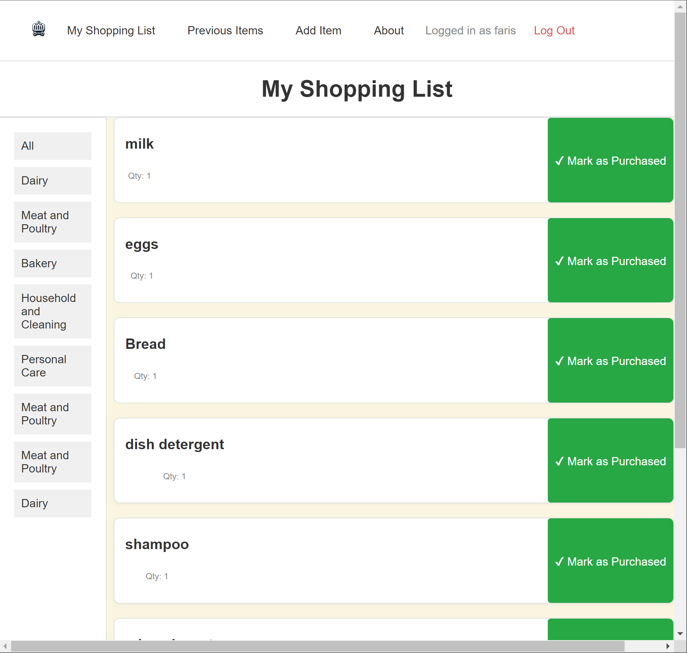

# **Grocerly**

# This is ***Grocerly***!
*Grocerly* takes the hassle out of grocery shopping by organizing your list and making your trip more efficient. No more forgetting what you need or wandering aimlessly around the store! With *Grocerly*, your *items* are neatly categorized so you can focus on the section you’re in, saving time and effort. It's your smart shopping assistant that makes sure you're always on track.

### Key Features:
* Easily Manage Your Items: Add, update, or delete items on your shopping list with ease, whenever it's convenient for you.

* Smart Shopping List: View your complete shopping list and mark items as "purchased" once you've picked them up, keeping track of what’s left to buy.

* Category-Based Organization: Organize your items into categories for a more efficient shopping experience. No more aimless searching – view items by category as you move through different sections of the store.

* Purchase History: Access your purchase history with ease. The history page keeps track of all the items you’ve marked as purchased, so you can review past shopping items anytime, you can even add them back to your shopping list.

## About the Creator
* [Faris Sharayri](https://github.com/FSharayri) - Full Stack Developer, UI Developer, Database Manager, Github Manager
